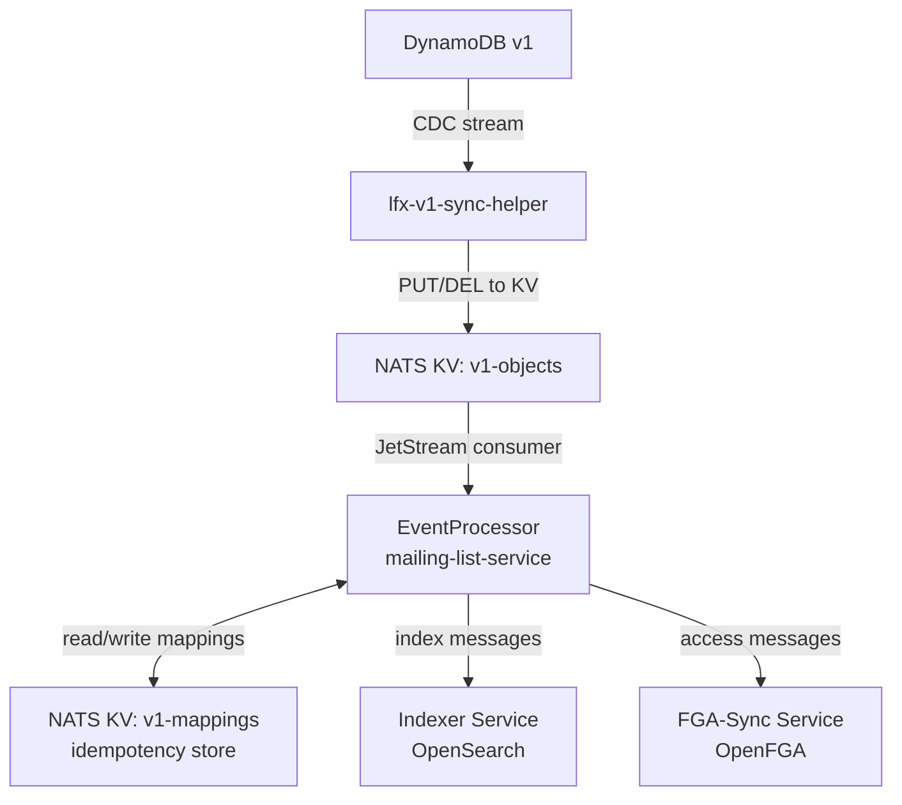
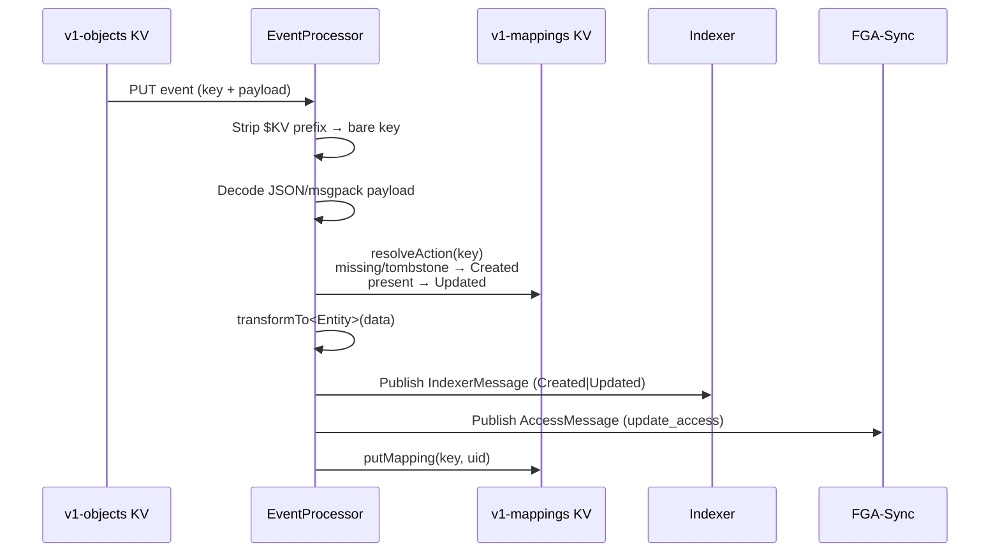
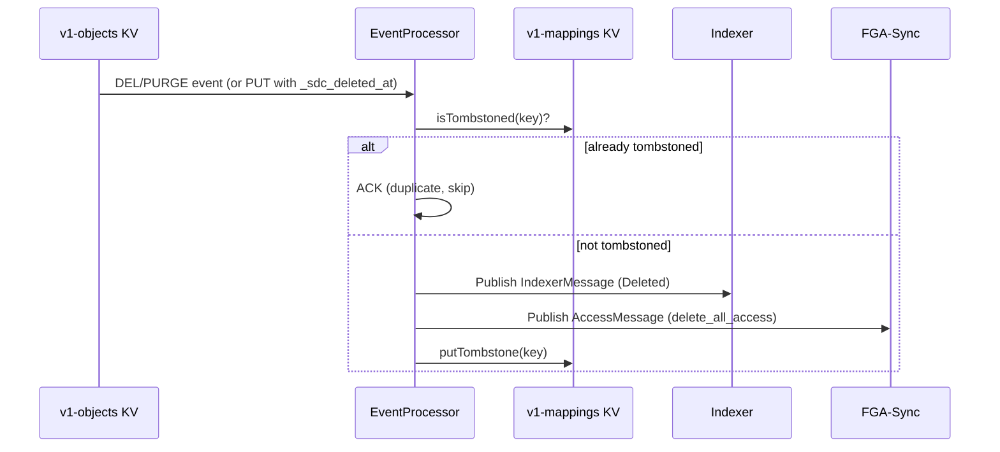
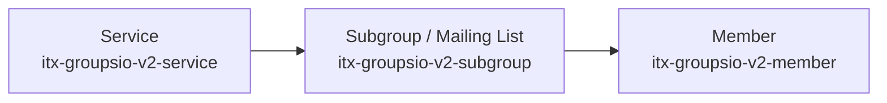
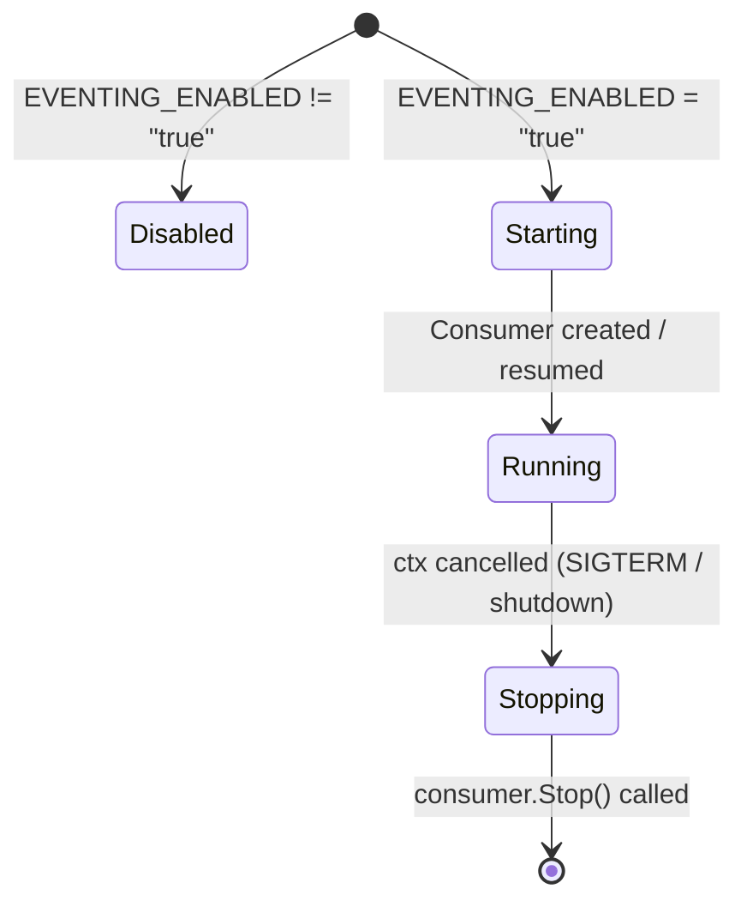

# Event Processing

## Overview

The mailing list service implements a NATS JetStream KV-bucket event processor that syncs GroupsIO entities (services, mailing lists, and members) from v1 DynamoDB into v2 — enabling real-time data synchronization without manual intervention.

The pipeline is driven by the `lfx-v1-sync-helper` component, which writes DynamoDB change events into the `v1-objects` KV bucket. The mailing list service consumes those events, transforms them into v2 domain models, and publishes the results to the indexer and access-control (FGA-sync) services.

---

## Architecture

### Components



### Key Prefix → Entity Mapping

| KV Key Prefix | Entity Type |
|---|---|
| `itx-groupsio-v2-service.<uid>` | GroupsIO Service |
| `itx-groupsio-v2-subgroup.<uid>` | Mailing List (subgroup) |
| `itx-groupsio-v2-member.<uid>` | Member |

---

## Event Flow

### Create / Update Flow



### Delete Flow

Deletes arrive in two forms:

- **Soft delete** — a regular PUT payload that contains the `_sdc_deleted_at` field (injected by `lfx-v1-sync-helper` on DynamoDB REMOVE events).
- **Hard delete / PURGE** — a KV message with the `Kv-Operation: DEL` or `Kv-Operation: PURGE` header.



### Parent Dependency (Ordering Guarantee)

To avoid orphaned documents in OpenSearch, child entities wait for their parent to be processed first:



- A **subgroup** event is NAK'd with backoff if the parent service mapping is absent from `v1-mappings`.
- A **member** event is NAK'd with backoff if the parent subgroup mapping is absent from `v1-mappings`.

### Reverse Index (group_id → UID)

Members store a `group_id` (Groups.io numeric ID) rather than the v2 `mailing_list_uid`. When the subgroup handler successfully processes a mailing list, it writes a reverse index entry:

```
v1-mappings key:  groupsio-subgroup-gid.<group_id>
value:            <mailing_list_uid>
```

The member handler reads this entry to resolve the parent `MailingListUID` before building the indexer message.

---

## Data Transformation

### Service (`GrpsIOService`)

| v1 DynamoDB field | v2 model field |
|---|---|
| `group_service_type` | `Type` |
| `domain` | `Domain` |
| `group_id` | `GroupID` |
| `prefix` | `Prefix` |
| `project_id` | `ProjectUID` |
| `last_modified_at` | `UpdatedAt` |
| _(hardcoded)_ | `Source = "v1-sync"` |

### Mailing List / Subgroup (`GrpsIOMailingList`)

| v1 DynamoDB field | v2 model field |
|---|---|
| `group_id` | `GroupID` |
| `group_name` | `GroupName` |
| `visibility == "Public"` | `Public` |
| `type` | `Type` |
| `description` | `Description` |
| `subject_tag` | `SubjectTag` |
| `parent_id` | `ServiceUID` |
| `project_id` | `ProjectUID` |
| `committee` | `Committees[0].UID` |
| `committee_filters` | `Committees[0].AllowedVotingStatuses` |
| `last_modified_at` | `UpdatedAt` |
| _(hardcoded)_ | `Source = "v1-sync"` |

### Member (`GrpsIOMember`)

| v1 DynamoDB field | v2 model field |
|---|---|
| `member_id` | `MemberID` |
| `group_id` | `GroupID` |
| `full_name` (split on first space) | `FirstName`, `LastName` |
| `email` | `Email` |
| `organization` | `Organization` |
| `job_title` | `JobTitle` |
| `member_type` | `MemberType` |
| `delivery_mode` | `DeliveryMode` |
| `mod_status` | `ModStatus` |
| `status` | `Status` |
| `created_at` | `CreatedAt` |
| `last_modified_at` | `UpdatedAt` |
| _(resolved from reverse index)_ | `MailingListUID` |
| _(hardcoded)_ | `Source = "v1-sync"` |

> Note: Members do **not** publish a separate FGA access message — access is inherited from the parent mailing list's access record.

---

## NATS Subjects Published

| Entity | Action | Subject |
|---|---|---|
| Service | Created / Updated | `lfx.index.groupsio_service` |
| Service | Created / Updated | `lfx.update_access.groupsio_service` |
| Service | Deleted | `lfx.index.groupsio_service` |
| Service | Deleted | `lfx.delete_all_access.groupsio_service` |
| Mailing List | Created / Updated | `lfx.index.groupsio_mailing_list` |
| Mailing List | Created / Updated | `lfx.update_access.groupsio_mailing_list` |
| Mailing List | Deleted | `lfx.index.groupsio_mailing_list` |
| Mailing List | Deleted | `lfx.delete_all_access.groupsio_mailing_list` |
| Member | Created / Updated | `lfx.index.groupsio_member` |
| Member | Deleted | `lfx.index.groupsio_member` |

---

## Deduplication

The `v1-mappings` KV bucket tracks processing state for each entity:

| State | Key Pattern | Value |
|---|---|---|
| Synced (service) | `groupsio-service.<uid>` | `<uid>` |
| Synced (subgroup) | `groupsio-subgroup.<uid>` | `<uid>` |
| Synced (member) | `groupsio-member.<uid>` | `<uid>` |
| Reverse index | `groupsio-subgroup-gid.<group_id>` | `<uid>` |
| Deleted (tombstone) | any of the above | `!del` |

On consumer redelivery, tombstone markers prevent duplicate downstream operations. Missing keys and tombstoned entries are both treated as "never seen" for create-vs-update resolution.

---

## Configuration

### Environment Variables

| Variable | Default | Description |
|---|---|---|
| `EVENTING_ENABLED` | _(unset)_ | Set to `true` to enable the data stream processor |
| `EVENTING_CONSUMER_NAME` | `mailing-list-service-kv-consumer` | Durable JetStream consumer name |
| `EVENTING_MAX_DELIVER` | `3` | Maximum delivery attempts before giving up |
| `EVENTING_ACK_WAIT_SECS` | `30` | Seconds the server waits for ACK before redelivering |
| `EVENTING_MAX_ACK_PENDING` | `1000` | Maximum in-flight unacknowledged messages |
| `NATS_URL` | `nats://lfx-platform-nats.lfx.svc.cluster.local:4222` | NATS server connection URL |

### Consumer Configuration

| Setting | Value |
|---|---|
| Delivery Policy | `DeliverLastPerSubjectPolicy` (resumes from last seen record per key after restart) |
| Ack Policy | `AckExplicitPolicy` (explicit ACK required) |
| Filter Subjects | `$KV.v1-objects.itx-groupsio-v2-service.>`, `$KV.v1-objects.itx-groupsio-v2-subgroup.>`, `$KV.v1-objects.itx-groupsio-v2-member.>` |
| Stream | `KV_v1-objects` |

---

## Error Handling

### Transient Errors (NAK — retry)

The handler returns `true` (NAK) for:
- Parent mapping absent (subgroup waiting for service; member waiting for subgroup)
- Transient publish failures to indexer or FGA-sync (as determined by `pkgerrors.IsTransient`)

The consumer redelivers after the `AckWait` backoff, up to `MaxDeliver` times.

### Permanent Errors (ACK — skip)

The handler returns `false` (ACK) for:
- Unrecognised KV key prefix
- Missing required fields (e.g., member with no `group_id`)
- Message metadata read failure (poison-pill guard)
- Payload decode failure

These events are logged at `ERROR` level and discarded to prevent the consumer from stalling indefinitely.

---

## Lifecycle



1. **Startup**: `handleDataStream` is called from `main.go` after the NATS client is ready. If `EVENTING_ENABLED` is not `true`, the function is a no-op.
2. **Running**: The processor consumes messages in the background goroutine until context cancellation.
3. **Shutdown**: A second goroutine waits for `ctx.Done()` and calls `processor.Stop()` with a graceful-shutdown timeout.

---

## Operations

### Enable Event Processing

```bash
export EVENTING_ENABLED=true
make run
```

### Disable Event Processing (e.g., local dev)

```bash
# Simply omit the variable or set it to anything other than "true"
unset EVENTING_ENABLED
make run
```

### Monitoring

Watch for these log messages:

| Log message | Meaning |
|---|---|
| `data stream processor started successfully` | Consumer running |
| `data stream processor context cancelled` | Normal shutdown |
| `parent service not yet processed, NAKing subgroup for retry` | Ordering backpressure |
| `parent subgroup not yet processed, NAKing member for retry` | Ordering backpressure |
| `service/subgroup/member already deleted, ACKing duplicate` | Idempotent delete |
| `data stream KV consumer error` | NATS consumer-level error |

### Troubleshooting

| Symptom | Action |
|---|---|
| No events processed | Verify `EVENTING_ENABLED=true`, check NATS connectivity, confirm `v1-objects` bucket exists |
| Repeated NAK / ordering failures | Ensure `lfx-v1-sync-helper` is populating the KV bucket in dependency order |
| Duplicate events replayed | Inspect `v1-mappings` bucket for missing tombstones |
| Consumer not progressing | Check downstream indexer / FGA-sync availability; review `EVENTING_MAX_DELIVER` |

---

## Development

### Code Structure

```
cmd/mailing-list-api/
├── data_stream.go                        # Startup wiring, env config
└── eventing/
    ├── event_processor.go                # JetStream consumer lifecycle
    └── handler.go                        # Key-prefix router (HandleChange / HandleRemoval)

internal/
├── domain/port/
│   └── mapping_store.go                  # MappingReader / MappingWriter / MappingReaderWriter
├── infrastructure/nats/
│   └── mapping_store.go                  # JetStream KV implementation (hides tombstone details)
└── service/
    ├── datastream_service_handler.go     # Service transform + publish
    ├── datastream_subgroup_handler.go    # Mailing list transform + publish + reverse index
    └── datastream_member_handler.go      # Member transform + publish
```

The `MappingReaderWriter` port abstracts all `v1-mappings` KV operations (create-vs-update resolution, parent-dependency checks, tombstone writes) behind domain-meaningful methods. The JetStream KV details — including the `!del` tombstone marker — are encapsulated entirely in `internal/infrastructure/nats/mapping_store.go`.

### Adding a New Entity Type

1. Add KV key prefix constant in [eventing/handler.go](../cmd/mailing-list-api/eventing/handler.go)
2. Register the new prefix in the `switch` inside `HandleChange` and `HandleRemoval`, delegating to the new handler functions
3. Create `internal/service/datastream_xxx_handler.go` with `HandleDataStreamXxxUpdate` / `HandleDataStreamXxxDelete`
4. Add `transformV1ToXxx` conversion function in the same file
5. Add mapping prefix constants to [pkg/constants/storage.go](../pkg/constants/storage.go)
6. Add published subject constants to [pkg/constants/subjects.go](../pkg/constants/subjects.go)
7. Write unit tests

### Testing Locally

```bash
# Disable event processing for pure API development
unset EVENTING_ENABLED
make run

# Enable with a local NATS server
export EVENTING_ENABLED=true
export NATS_URL=nats://localhost:4222
make run

# Inject a test event manually
nats kv put v1-objects itx-groupsio-v2-service.test-uid '{"group_service_type":"primary","project_id":"proj-1","domain":"groups.io"}'

# Verify mapping was written
nats kv get v1-mappings groupsio-service.test-uid

# Run unit tests
go test ./cmd/mailing-list-api/eventing/... ./internal/service/... -v
```

---

## Related Services

| Service | Role |
|---|---|
| **lfx-v1-sync-helper** | Bridges DynamoDB CDC into the `v1-objects` NATS KV bucket |
| **Indexer** | Consumes indexer messages and upserts/deletes records in OpenSearch |
| **FGA-Sync** | Consumes access messages and manages OpenFGA relationship tuples |
